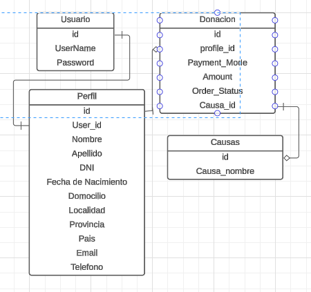

# App de donaciones para catástrofes

## Documentación

-   Clona el repositorio de GitHub utilizando el comando `git clone --URL`
-   Instala los paquetes de Node con el comando `npm install`
-   Ejecuta el comando `npm start`

## Modelos de Entidad Relacional

<strong>Diagrama de Entidad Relacional</strong>

<i>Diagrama de entidad relacional del usuario</i>
 

flujo de datos para realizar el correspondiente donativo.

## Prisma se está utilizando como ORM , sus comandos son

-   [Prisma](https://prisma.io)
-   Instalacion de Prisma `npm install prisma --save-dev`
-   Inicializar Prisma `npx prisma init --datasource-provider PostgreSQL`
-   Crear el Schema de Prisma
-   Crear el Cliente de Prisma
-   Si ya se tiene una base de datos puede usarse el comando `npm prisma db pull` para crear el Schema basado en ella
-   Ejecutar el comando para la migracion `npm prisma migrate dev --name nombreMigra`

## VARIABLES DE ENTORNO

-   `DATABASE_URL`: URL de la base de datos
-   `NODE_ENV`: `development` o `production`
-   
=======
## Imagen de Docker para la BDD PostgreSQL

- Instalar Docker, en widows y mac, por defecto viene instalado Docker compose
- Agregar un archivo .env en la raiz del proyecto
- Agregar las siguientes variables de entorno:
    -`POSTGRES_DB=smarthelp_bd
      POSTGRES_USER=smart_help
      POSTGRES_PASSWORD=password123`
- Ejecuta el comando `docker-compose up`, y se inicializara una imagen de postgres con la BDD ya creada.

